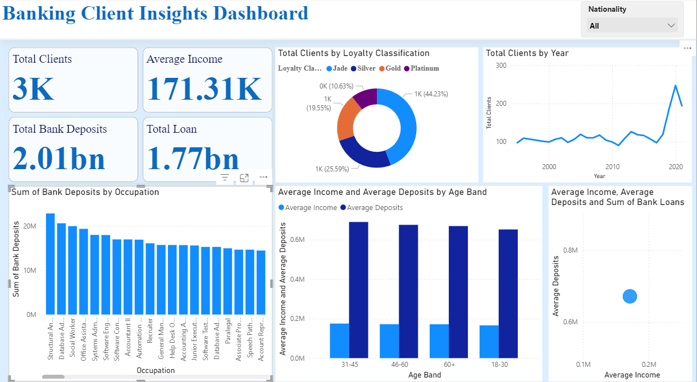

# Banking Analytics Dashboard

## 📌 Project Overview
This project analyzes banking customer data to uncover insights into deposits, loans, income distribution, and client demographics. The goal is to help financial institutions make data-driven decisions and improve client targeting.

**Key Features**
- **Data Preprocessing:** Python & Pandas for cleaning and transformation.
- **Exploratory Data Analysis (EDA):** Visualizing trends and relationships.
- **Power BI Dashboard:** Interactive visuals for business insights.
- **Geographical Analysis:** Filled map showing deposits by nationality.

---

## 🛠️ Tools & Technologies
- **Languages:** Python (Pandas, NumPy, Matplotlib, Seaborn)
- **Database:** MySQL (optional integration)
- **Visualization:** Power BI
- **Data Source:** Banking dataset (CSV/XLSX)

---

## 📊 Dashboard Preview

